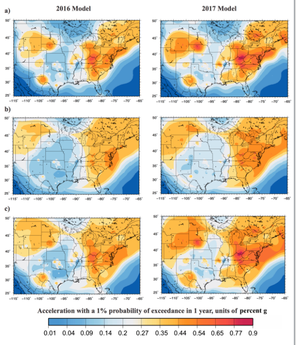

# Estimating Uncertainties in Seismic Hazard Maps

This code performes Bootstrapping on more than 20 mollion sets of probabilistic hazard estimates and obtain %95 confidence interval of the models. Results have been published in:

`Mousavi, S. M., G. C. Beroza, and S. M. Hoover (2018). Variabilities in Probabilistic Seismic Hazard Maps
for Natural and Induced Seismicity in the Central and Eastern United States, The leading Edge, 37(2), 141a1-
141a9, https://doi.org/10.1190/tle37020810.1.`

BibTeX:

    @article{mousavi2018variabilities,
     title={Variabilities in probabilistic seismic hazard maps for natural and induced seismicity in the central and eastern United States},
     author={Mousavi, S Mostafa and Beroza, Gregory C and Hoover, Susan M},
     journal={The Leading Edge},
     volume={37},
     number={2},
      pages={141a1--141a9},
     year={2018},
     publisher={Society of Exploration Geophysicists Tulsa, Oklahoma}
    }

## Paper
(https://www.researchgate.net/publication/322902492_Variabilities_in_probabilistic_seismic_hazard_maps_for_natural_and_induced_seismicity_in_the_central_and_eastern_United_States)

----------------------

## Abstract
Probabilistic seismic hazard analysis (PSHA) characterizes ground-motion hazard from earthquakes. Typically, the time horizon of a PSHA forecast is long, but in response to induced seismicity related to hydrocarbon development, the USGS developed one-year PSHA models. In this paper, we present a display of the variability in USGS hazard curves due to epistemic uncertainty in its informed submodel using a simple bootstrapping approach. We find that variability is highest in low-seismicity areas. On the other hand, areas of high seismic hazard, such as the New Madrid seismic zone or Oklahoma, exhibit relatively lower variability simply because of more available data and a better understanding of the seismicity. Comparing areas of high hazard, New Madrid, which has a history of large naturally occurring earthquakes, has lower forecast variability than Oklahoma, where the hazard is driven mainly by suspected induced earthquakes since 2009. Overall, the mean hazard obtained from bootstrapping is close to the published model, and variability increased in the 2017 one-year model relative to the 2016 model. Comparing the relative variations caused by individual logic-tree branches, we find that the highest hazard variation (as measured by the 95% confidence interval of bootstrapping samples) in the final model is associated with different ground-motion models and maximum magnitudes used in the logic tree, while the variability due to the smoothing distance is minimal. It should be pointed out that this study is not looking at the uncertainty in the hazard in general, but only as it is represented in the USGS one-year models.

## Results

95% confidence interval of bootstrapping showing variability of 1% probability of exceedance from the 2016 (left column) and 2017 (right column) model for PGA (a) 1 Hz and (b) 5 Hz spectral acceleration (c)
 

